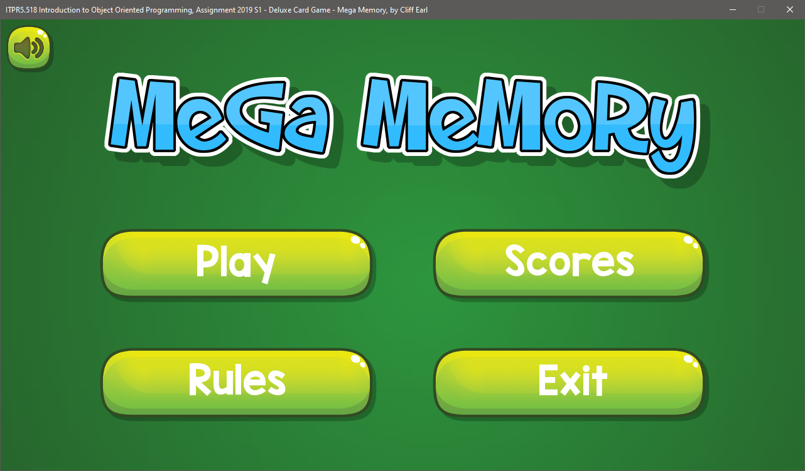

## Mega Memory

### About

Mega Memory is a card game I created whilst working towards gaining my Bachelor in Computing Systems degree.

The objective in Mega Memory is to find matching pairs, and when all the pairs have been found, have the most pairs to win.

You can play versus another human player or against an computer player, with the computer player having 3 difficulty levels.

You can choose the size of the game board (how many cards are laid out) and the game has a persistent high score feature.

The requirements for the assignment were to create a a functioning card game using Windows Forms without using any cool stuff like OpenGL or DirectX, just good old Windows Forms.

After messing about with said Forms for a while I decided that they are really quite FUgly, so I decided in true **me** style to forgo all of the Windows Forms guff and create my own Windows Form based 2D game engine, complete with a Graphical User Interface. I ended up cheating however and used two TextBoxes for entering the player names because I really didn't want to fart about creating my own. Besides that, everything you see inside the Windows Form border is done in code.

Anyway, the code is fairly well commented and if you have questions then just raise an issue or fire me a message :)

Please note that this was my first adventure with C# so there are probably a whole bunch of n00b mistakes in there, and because it's a Windows Form, it is not suited to anything that requires lots of animated graphics whatsoever.
